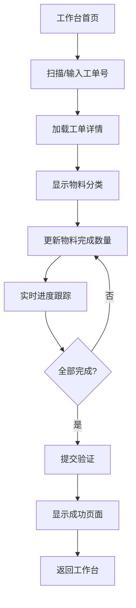

# PickingVerificationApp 深度分析报告

## 项目概述

**项目名称:** PickingVerificationApp (拣配流程追溯与验证程序)
**核心功能:** 合箱校验 (Container Verification)
**技术栈:** Flutter + BLoC + Clean Architecture
**当前状态:** 开发测试阶段，使用模拟数据

---

## 1. 应用架构分析

### 1.1 双入口设计

应用采用双入口设计，支持完整版和简化版两种运行模式：

#### 完整版 (`lib/main.dart`)
- **应用标题:** "拣配流程追溯与验证程序"
- **功能范围:** 完整的工业PDA功能集
- **身份验证:** 完整的JWT认证和权限管理
- **路由守卫:** 基于用户权限的页面访问控制
- **状态管理:** 全局AuthBloc + 各功能模块BLoC

#### 简化版 (`lib/main_simple.dart`)
- **应用标题:** "合箱校验系统"
- **功能范围:** 专注于合箱校验功能
- **身份验证:** 无认证，直接进入工作台
- **入口页面:** WorkbenchHomeScreen
- **状态管理:** 仅SimplePickingBloc

### 1.2 Clean Architecture 实现

```
lib/
├── core/                    # 核心模块
│   ├── api/                # 网络层 (DioClient)
│   ├── config/             # 路由配置 (AppRouter)
│   ├── theme/              # 主题配置
│   └── widgets/            # 通用组件
├── features/               # 功能模块
│   ├── auth/               # 身份认证
│   ├── picking_verification/ # 合箱校验 (核心功能)
│   ├── task_board/         # 任务看板
│   ├── order_verification/ # 订单验证
│   ├── platform_receiving/ # 平台接收
│   └── line_delivery/      # 线边配送
└── main.dart / main_simple.dart
```

每个功能模块遵循Clean Architecture三层结构：
- **data/** - 数据层 (datasources, models, repositories)
- **domain/** - 业务层 (entities, repositories, usecases)
- **presentation/** - 表现层 (pages, widgets, bloc)

---

## 2. 导航与路由系统

### 2.1 路由结构 (`lib/core/config/app_router.dart`)

| 路由路径 | 功能描述 | 认证要求 | 导航类型 |
|---------|---------|---------|---------|
| `/login` | 登录页面 | 无 | 独立页面 |
| `/workbench` | 工作台首页 | 无(简化版) | 独立页面 |
| `/home` | 主页 | 需要 | Shell路由 |
| `/tasks` | 任务看板 | 需要 | Shell路由 |
| `/picking-verification` | 合箱校验 | 需要 | Shell路由 |
| `/verification/:taskId/:orderId` | 订单验证 | 需要 | 独立页面 |
| `/verification-completion/:orderNumber` | 完成页面 | 需要 | 独立页面 |

### 2.2 导航模式

- **Shell路由:** 带底部导航栏的主应用功能
- **独立页面:** 工作界面，无底部导航栏，专注操作
- **权限守卫:** 基于用户角色的页面访问控制

---

## 3. 核心功能：合箱校验深度分析

### 3.1 业务流程



### 3.2 物料分类系统

应用将物料分为三大类，每类使用独立的Tab页面：

#### 断线领料 (Cable Materials)
- **用途:** 线缆类物料管理
- **特点:** 通常为高价值、关键路径物料
- **示例:** 电源线缆、信号线缆、网络线缆

#### 中央仓库 (Center Stock)
- **用途:** 中央仓储物料
- **特点:** 标准件、通用件
- **示例:** 螺丝、垫片、标准连接器

#### 标准仓库 (Standard Stock)
- **用途:** 标准库存物料
- **特点:** 常用消耗品、标签等
- **示例:** 标签、贴纸、包装材料

### 3.3 状态管理 (`SimplePickingBloc`)

#### 事件 (Events)
- `LoadWorkOrder(orderNo)` - 加载工单
- `UpdateMaterialQuantity(itemNo, quantity)` - 更新物料数量
- `SubmitVerification(updateBy, workCenter)` - 提交验证
- `ResetPickingState()` - 重置状态

#### 状态 (States)
- `SimplePickingInitial` - 初始状态（工单输入）
- `SimplePickingLoading` - 加载中
- `SimplePickingLoaded` - 已加载（包含修改标记）
- `SimplePickingSubmitting` - 提交中
- `SimplePickingSubmitted` - 提交成功
- `SimplePickingError` - 错误状态

### 3.4 实时进度跟踪

```dart
// 进度计算逻辑
overallProgress = completedMaterialCount / totalMaterialCount
isAllCompleted = (completedMaterialCount == totalMaterialCount)

// 分类统计
cableItemCount: 断线领料数量
rawItemCount: 中央仓库数量
labelCount: 标准仓库数量
```

---

## 4. API架构与数据管理

### 4.1 网络层架构

#### DioClient 配置 (`lib/core/api/dio_client.dart`)
```dart
// 多平台URL适配
Android模拟器: http://10.0.2.2:3000
iOS模拟器: http://localhost:3000
真实设备: http://192.168.31.53:3000
```

#### SimplePickingDataSource 配置
```dart
// 生产环境API
baseUrl: http://10.163.130.173:8001
endpoint: /api/WorkOrderPickVerf
```

### 4.2 当前模拟数据架构

应用当前使用完整的模拟数据系统进行测试：

#### 测试场景 (`_getMockWorkOrderData`)

| 工单号 | 场景描述 | 物料配置 |
|-------|---------|---------|
| `TEST001` / `123456789` | 完整测试工单 | 三类物料完整配置 |
| `EMPTY` / `TEST002` | 空工单测试 | 无物料，显示无需校验 |
| `PARTIAL` / `TEST003` | 部分完成工单 | 部分物料已完成 |
| `LARGE` / `TEST004` | 大批量测试 | 大量物料项目 |
| `ERROR` / `FAIL` | 错误处理测试 | 模拟API错误 |
| 其他 | 随机数据 | 动态生成测试数据 |

#### 模拟数据结构
```dart
WorkOrderData {
  orderId: int
  orderNo: String
  operationNo: String
  operationStatus: String
  cableItemCount: int       // 断线领料数量
  rawItemCount: int         // 中央仓库数量
  labelCount: int           // 标准仓库数量

  // 三类物料列表
  cabelItems: List<SimpleMaterialItem>
  centerStockItems: List<SimpleMaterialItem>
  stockItems: List<SimpleMaterialItem>
}
```

### 4.3 API接口设计

#### 获取工单详情
```http
GET /api/WorkOrderPickVerf?orderno={orderNo}
Response: WorkOrderPickVerfResponse<WorkOrderData>
```

#### 更新工单状态
```http
PUT /api/WorkOrderPickVerf
Body: WorkOrderStatusUpdateRequest
Response: WorkOrderStatusUpdateResponse<bool>
```

---

## 5. 用户界面分析

### 5.1 工作台首页 (`WorkbenchHomeScreen`)

**设计特点:**
- 实时时钟显示
- 模拟模式标识
- 合箱校验主功能入口
- 工业PDA友好的大按钮设计

### 5.2 合箱校验界面 (`SimplePickingScreen`)

**核心功能:**
- 扫码/手动输入工单号
- 三Tab物料分类显示
- 实时进度条和统计
- 物料数量更新
- 一键提交验证

**UI特色:**
- 高对比度配色方案
- 大字体适配工业环境
- 直观的进度指示器
- 触摸友好的大按钮

### 5.3 物料项组件 (`SimpleMaterialItemWidget`)

**显示信息:**
- 物料编码和描述
- 需求数量 vs 完成数量
- 进度百分比
- 状态指示器

---

## 6. 测试与开发状态

### 6.1 当前开发阶段

✅ **已完成功能:**
- 完整的UI框架和导航
- 合箱校验核心业务逻辑
- 物料分类和进度跟踪
- 模拟数据系统
- BLoC状态管理
- 错误处理机制

🔄 **开发中功能:**
- 真实API集成
- 认证系统完善
- 其他工业功能模块

### 6.2 测试脚本

#### 运行简化版本
```bash
./scripts/run_simple.sh
# 或
flutter run -t lib/main_simple.dart
```

#### 模拟数据测试
```bash
./scripts/test_mock_data.sh
```

### 6.3 测试流程建议

1. **基础功能测试**
   - 启动应用 → 进入工作台
   - 点击"合箱校验" → 功能界面
   - 输入 `TEST001` → 验证数据加载

2. **物料操作测试**
   - 验证三类物料正确分类显示
   - 更新各类物料完成数量
   - 观察实时进度变化
   - 测试完成后提交验证

3. **边界条件测试**
   - 空工单: `EMPTY`
   - 错误处理: `ERROR`
   - 大数据量: `LARGE`

---

## 7. 技术债务与改进建议

### 7.1 当前技术债务

1. **API集成待完成**
   - 真实API调用被注释
   - 需要环境配置管理
   - 错误处理需要完善

2. **认证系统**
   - JWT token管理已实现但未集成
   - 权限系统需要完善
   - 用户状态持久化

3. **测试覆盖率**
   - 单元测试需要补充
   - 集成测试待实现
   - E2E测试场景定义

### 7.2 下一步开发建议

#### 短期目标（1-2周）
1. **API集成测试**
   - 配置开发/测试/生产环境
   - 实现API调用切换开关
   - 完善网络错误处理

2. **数据持久化**
   - 实现离线数据缓存
   - 工单状态本地存储
   - 同步机制设计

#### 中期目标（1个月）
1. **功能完善**
   - 其他工业功能模块开发
   - 用户权限和角色管理
   - 系统配置和参数管理

2. **质量提升**
   - 单元测试覆盖率达到80%+
   - 集成测试自动化
   - 性能优化和内存管理

#### 长期目标（2-3个月）
1. **生产就绪**
   - 完整的错误监控和日志
   - 用户行为分析
   - 版本更新机制

2. **扩展性**
   - 多租户支持
   - 国际化和本地化
   - 插件化架构

---

## 8. 关键文件索引

### 8.1 核心配置文件
- `lib/main.dart` - 完整版应用入口
- `lib/main_simple.dart` - 简化版应用入口
- `lib/core/config/app_router.dart` - 路由配置
- `lib/core/api/dio_client.dart` - 网络客户端

### 8.2 合箱校验功能文件
- `lib/features/picking_verification/presentation/pages/simple_picking_screen.dart` - 主界面
- `lib/features/picking_verification/presentation/bloc/simple_picking_bloc.dart` - 状态管理
- `lib/features/picking_verification/data/datasources/simple_picking_datasource.dart` - 数据源
- `lib/features/picking_verification/domain/entities/simple_picking_entities.dart` - 业务实体

### 8.3 测试和工具
- `scripts/run_simple.sh` - 简化版启动脚本
- `scripts/test_mock_data.sh` - 模拟数据测试脚本
- `test/` - 测试文件目录

---

## 9. 总结

PickingVerificationApp 是一个设计良好的工业级Flutter应用，采用Clean Architecture和BLoC模式，专注于合箱校验功能。当前处于开发测试阶段，使用完整的模拟数据系统，为后续真实API集成奠定了良好基础。

**核心优势:**
- 清晰的架构设计和代码组织
- 完善的状态管理和错误处理
- 工业PDA友好的UI设计
- 灵活的双入口和测试系统

**下一步重点:**
- 完成真实API集成
- 补充测试覆盖率
- 完善认证和权限系统
- 准备生产环境部署

该应用已具备良好的技术基础，可以顺利进入下一阶段的深度测试和API集成开发。