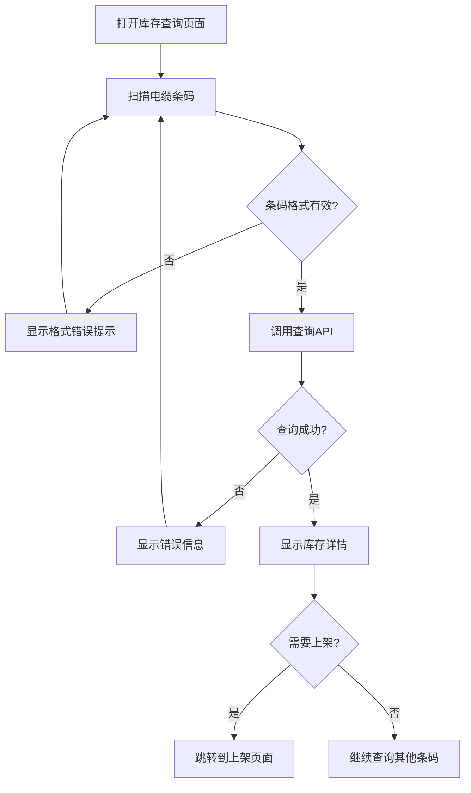
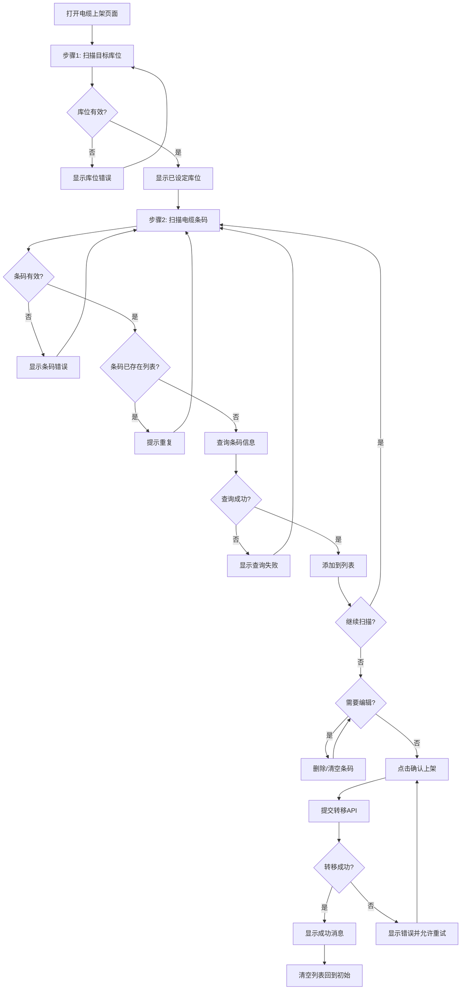

# 线边库存管理功能 - 需求规格说明

**文档版本**: 1.0
**创建日期**: 2025-10-27
**负责团队**: 移动端开发组
**目标平台**: Android 工业PDA

---

## 1. 功能概述

### 1.1 业务背景

在制造业生产流程中，断线电缆等物料需要在生产线边的库位之间进行转移和管理。本功能为仓库操作员提供移动端工具，通过扫描条码实现：
- 快速查询电缆物料的当前库存状态
- 将电缆物料从当前位置转移到目标库位（上架操作）

### 1.2 目标用户

- **主要用户**: 仓库操作员、物料管理员
- **使用场景**: 使用工业PDA设备，在仓库现场操作
- **操作频率**: 高频使用（每天数十到上百次操作）

### 1.3 核心价值

- ✅ 提高库存查询效率（无需回到电脑前查询）
- ✅ 减少上架操作错误（扫码验证，避免手工记录错误）
- ✅ 实时更新库存位置（与MES系统同步）
- ✅ 提升仓库管理数字化水平

---

## 2. 功能需求

### 2.1 功能1: 库存查询

#### 用户故事
```
作为 仓库操作员
我想要 通过扫描电缆条码快速查询库存信息
以便于 立即了解该电缆的物料信息、数量和当前存放位置
```

#### 功能描述

用户可以通过扫描单个电缆条码或手动输入条码，查询该电缆在线边库存中的详细信息。

#### 操作流程



#### 输入要求

| 输入项 | 类型 | 必填 | 格式要求 | 说明 |
|-------|------|------|---------|------|
| 条码 | String | 是 | 长度 > 0 | 电缆唯一条码标识 |
| 工厂ID | Integer | 否 | - | 可选参数，默认当前工厂 |

#### 输出展示

查询成功后，显示以下信息：

| 字段 | 说明 | 示例 |
|-----|------|-----|
| 物料编码 | 物料系统编码 | C12345 |
| 物料描述 | 物料名称和规格 | 断线电缆 XX型 |
| 当前数量 | 库存数量 | 150 PCS |
| 批次号 | 生产批次 | BATCH-001 |
| 当前库位 | 存放位置编码 | A-01-02 |
| 条码 | 查询的条码 | BC123456789 |

#### 验收标准

- [x] 支持扫码头扫描输入（自动提交）
- [x] 支持手动键盘输入（回车提交）
- [x] 扫描后输入框自动清空
- [x] 查询结果在2秒内返回并显示
- [x] 条码不存在时显示明确错误提示
- [x] 网络异常时显示友好提示并允许重试
- [x] 查询成功后可快速跳转到上架功能

---

### 2.2 功能2: 电缆上架（库存转移）

#### 用户故事
```
作为 仓库操作员
我想要 通过扫描目标库位和电缆条码批量完成上架操作
以便于 快速准确地将多个电缆转移到指定库位
```

#### 功能描述

用户先扫描目标库位，然后连续扫描需要上架的电缆条码（可扫描多个），系统自动验证每个条码并显示物料信息，用户确认后提交转移请求。

#### 操作流程



#### 分步操作说明

**步骤1: 设置目标库位**
- 用户扫描或输入目标库位编码
- 系统验证库位存在性
- 显示"已设定库位: XXX"
- 提供"修改库位"按钮允许重新设置

**步骤2: 扫描电缆条码（可多个）**
- 用户连续扫描电缆条码
- 每扫描一个条码，系统：
  1. 检查是否重复
  2. 调用查询API验证条码
  3. 获取物料信息
  4. 添加到列表并显示

**步骤3: 编辑列表（可选）**
- 每个条码项显示：
  - 条码号
  - 物料编码和描述
  - 当前库位
  - [删除] 按钮
- 顶部提供 [清空列表] 按钮

**步骤4: 确认上架**
- 检查：目标库位已设定 ✓
- 检查：至少有一个电缆 ✓
- 点击 [确认上架] 提交
- 等待API响应
- 成功后清空所有数据

#### 输入要求

| 输入项 | 类型 | 必填 | 格式要求 | 说明 |
|-------|------|------|---------|------|
| 目标库位 | String | 是 | 库位编码格式 | 转移的目标位置 |
| 电缆条码列表 | Array<String> | 是 | 至少1个 | 需要转移的电缆条码 |

#### 约束条件

- ⚠️ 每次转移只能有一个目标库位
- ⚠️ 可以同时转移多个电缆到同一库位
- ⚠️ 条码不能重复（列表中唯一性）
- ⚠️ 每个条码必须通过查询验证后才能添加

#### 输出展示

**已扫描列表项显示**:
```
┌────────────────────────────┐
│ 1. BC123456789              │
│    C12345 - 断线电缆         │
│    当前位置: A-01-02   [删除]│
└────────────────────────────┘
```

**转移信息摘要**:
- 目标库位: B-02-05
- 转移数量: 3 个电缆

#### 验收标准

- [x] 必须先扫描目标库位，后扫描电缆
- [x] 可以修改已设定的目标库位
- [x] 可以连续扫描多个电缆条码
- [x] 扫描时自动查询并验证条码
- [x] 重复条码时提示并不添加
- [x] 无效条码时提示但保持当前列表
- [x] 可以删除单个条码
- [x] 可以清空整个列表
- [x] 列表为空时不能提交
- [x] 转移成功后显示成功消息
- [x] 转移成功后自动清空所有数据
- [x] 转移失败时允许重试
- [x] 所有操作响应时间 < 3秒

---

## 3. UI/UX 设计规范

### 3.1 设备适配

**目标设备**: Android 工业PDA
- 屏幕尺寸: 5-6 英寸
- 分辨率: 1280x720 或更高
- 方向: 竖屏（Portrait）
- 输入方式: 扫码头（主要）+ 触摸屏

### 3.2 设计原则

1. **大字体**: 最小字体 14sp，主要信息 16-20sp，标题 22-28sp
2. **高对比度**: 使用深色文字 + 白色背景，重要信息使用强调色
3. **大触摸区域**: 按钮最小 48dp x 48dp，行高最小 56dp
4. **简化操作**: 优先扫码输入，减少手动输入
5. **即时反馈**: 扫码后立即视觉/触觉反馈

### 3.3 颜色规范

| 用途 | 颜色 | 使用场景 |
|-----|------|---------|
| 主色调 | Blue #2196F3 | 按钮、标题栏 |
| 成功 | Green #4CAF50 | 成功提示、已完成状态 |
| 警告 | Orange #FF9800 | 警告信息 |
| 错误 | Red #F44336 | 错误提示、失败状态 |
| 中性 | Grey #757575 | 辅助文字、禁用状态 |
| 背景 | White #FFFFFF | 主背景 |
| 卡片背景 | Light Grey #F5F5F5 | 信息卡片背景 |

### 3.4 页面布局

#### 库存查询页面

```
┌─────────────────��───────────────────┐
│  📦 库存查询            [返回]       │  ← 标题栏 (56dp)
├─────────────────────────────────────┤
│                                     │
│  扫描电缆条码查询库存                │  ← 说明文字 (16sp)
│                                     │
│  ┌────────────────────────────┐    │
│  │  条码: [____________] 📷   │    │  ← 输入区域 (56dp)
│  └────────────────────────────┘    │
│                                     │
│  [查询库存] [清空]                   │  ← 操作按钮 (48dp)
│                                     │
│  ──────────────────────────────    │  ← 分隔线
│                                     │
│  库存信息                            │  ← 结果标题 (18sp)
│  ┌────────────────────────────┐    │
│  │ 📋 物料信息                 │    │
│  │ • 物料编码: C12345          │    │  ← 信息卡片
│  │ • 物料描述: 断线电缆 XX型    │    │     (行高 40dp)
│  │                            │    │
│  │ 📊 库存状态                 │    │
│  │ • 当前数量: 150 PCS        │    │
│  │ • 批次号: BATCH-001        │    │
│  │ • 当前库位: A-01-02        │    │
│  └────────────────────────────┘    │
│                                     │
│  [ 转到上架页面 ]                    │  ← 操作按钮 (56dp)
│                                     │
└─────────────────────────────────────┘
```

#### 电缆上架页面

```
┌─────────────────────────────────────┐
│  📤 电缆上架            [返回]       │
├─────────────────────────────────────┤
│                                     │
│  ① 扫描目标库位                      │  ← 步骤标题 (18sp)
│  ┌────────────────────────────┐    │
│  │ 目标库位: B-02-05     📷   │    │  ← 库位输入 (56dp)
│  │          [已设定]           │    │
│  └────────────────────────────┘    │
│  [修改库位]                          │
│                                     │
│  ──────────────────────────────    │
│                                     │
│  ② 扫描电缆条码（可扫描多个）         │
│  ┌────────────────────────────┐    │
│  │  条码: [____________] 📷   │    │  ← 条码输入 (56dp)
│  └────────────────────────────┘    │
│                                     │
│  已扫描电缆 (3)          [清空列表]  │  ← 列表标题
│  ┌────────────────────────────┐    │
│  │ 1. BC123456789              │    │
│  │    C12345 - 断线电缆         │    │  ← 列表项
│  │    当前位置: A-01-02   [删除]│    │     (行高 72dp)
│  ├────────────────────────────┤    │
│  │ 2. BC123456790              │    │
│  │    C12346 - 断线电缆         │    │
│  │    当前位置: A-01-03   [删除]│    │
│  ├────────────────────────────┤    │
│  │ 3. BC123456791              │    │
│  │    C12347 - 断线电缆         │    │
│  │    当前位置: A-01-05   [删除]│    │
│  └────────────────────────────┘    │
│                                     │
│  转移信息                            │
│  • 目标库位: B-02-05                │
│  • 转移数量: 3 个电缆               │
│                                     │
│  [确认上架]                          │  ← 主操作按钮 (56dp)
│                                     │
└─────────────────────────────────────┘
```

### 3.5 交互设计

#### 扫码体验优化

1. **自动聚焦**: 页面加载后输入框自动聚焦
2. **扫码提交**: 扫码头扫描后自动提交（延迟100ms防抖）
3. **自动清空**: 提交后自动清空输入框
4. **震动反馈**: 扫码成功后设备震动50ms
5. **声音反馈**: 可选的提示音（设置中开关）

#### 错误处理

| 错误类型 | 提示方式 | 提示内容 | 操作 |
|---------|---------|---------|------|
| 条码格式错误 | Toast + 震动 | "条码格式不正确" | 保持页面状态 |
| 条码不存在 | SnackBar | "未找到该条码的库存信息" | 允许重试 |
| 条码重复 | SnackBar | "条码已存在：BC123456789" | 不添加到列表 |
| 网络异常 | Dialog | "网络连接失败，请检查网络" | 提供重试按钮 |
| 转移失败 | Dialog | "上架失败：[具体原因]" | 提供重试按钮 |

#### 成功反馈

| 操作 | 反馈方式 | 提示内容 |
|-----|---------|---------|
| 查询成功 | 卡片展开动画 | 显示库存信息 |
| 添加成功 | 列表项滑入 + 震动 | 列表增加一项 |
| 转移成功 | Dialog + 震动 | "成功上架 3 个电缆到 B-02-05" |

---

## 4. 非功能性需求

### 4.1 性能要求

| 指标 | 要求 | 说明 |
|-----|------|------|
| API响应时间 | < 2秒 | 查询和转移接口 |
| 页面加载时间 | < 1秒 | 页面初始化 |
| 扫码响应时间 | < 500ms | 扫码到显示反馈 |
| 列表渲染 | 60fps | 流畅滚动 |
| 内存占用 | < 200MB | 应用运行时 |

### 4.2 可用性要求

- **网络容错**: 网络异常时不崩溃，显示友好提示
- **离线支持**: 暂不需要（V2考虑）
- **多语言**: 暂仅支持简体中文
- **易用性**: 新用户5分钟内学会使用

### 4.3 安全性要求

- ✅ API调用需要认证token
- ✅ 敏感信息不在日志中输出
- ✅ 网络传输使用HTTPS（生产环境）
- ✅ 用户操作记录审计日志

### 4.4 兼容性要求

- **Android版本**: Android 10 (API 29) 及以上
- **设备品牌**: 支持主流工业PDA（Honeywell, Zebra, Chainway等）
- **扫码头**: 支持标准HID键盘模式的扫码头

---

## 5. 约束条件与假设

### 5.1 技术约束

- ✓ 使用Flutter框架开发
- ✓ 遵循Clean Architecture架构
- ✓ 使用BLoC模式进行状态管理
- ✓ 使用Dio进行网络请求
- ✓ 使用mobile_scanner包支持相机扫码

### 5.2 业务约束

- ✓ 每次转移只能有一个目标库位
- ✓ 条码必须在系统中存在且有效
- ✓ 转移操作需要实时同步到MES系统
- ✓ 用户必须登录后才能使用此功能

### 5.3 假设

- ✓ 后端API已实现并可用
- ✓ 条码格式统一且唯一
- ✓ 库位编码格式统一
- ✓ 网络环境稳定（仓库内WiFi覆盖）
- ✓ 扫码头工作正常

---

## 6. 验收测试用例

### 6.1 库存查询功能

| 用例ID | 用例名称 | 前置条件 | 操作步骤 | 预期结果 |
|--------|---------|---------|---------|---------|
| TC-Q01 | 扫码查询成功 | 条码BC001在系统中存在 | 1. 打开查询页面<br>2. 扫描BC001 | 显示完整库存信息 |
| TC-Q02 | 手动输入查询 | - | 1. 手动输入BC002<br>2. 点击查询 | 显示库存信息 |
| TC-Q03 | 条码不存在 | 条码BC999不存在 | 1. 扫描BC999 | 显示"未找到库存信息" |
| TC-Q04 | 网络异常 | 断开网络 | 1. 扫描任意条码 | 显示网络错误提示 |
| TC-Q05 | 跳转上架 | 查询成功 | 1. 点击"转到上架页面" | 跳转到上架页面 |

### 6.2 电缆上架功能

| 用例ID | 用例名称 | 前置条件 | 操作步骤 | 预期结果 |
|--------|---------|---------|---------|---------|
| TC-S01 | 正常上架流程 | 库位B-01存在，条码BC001/BC002存在 | 1. 扫描库位B-01<br>2. 扫描BC001<br>3. 扫描BC002<br>4. 点击确认上架 | 转移成功，显示成功消息 |
| TC-S02 | 库位无效 | 库位XXX不存在 | 1. 扫描库位XXX | 显示库位错误提示 |
| TC-S03 | 条码重复 | - | 1. 设置库位<br>2. 扫描BC001<br>3. 再次扫描BC001 | 提示条码重复，不添加 |
| TC-S04 | 删除单个条码 | 列表中有3个条码 | 1. 点击第2个条码的删除按钮 | 该条码从列表移除 |
| TC-S05 | 清空列表 | 列表中有5个条码 | 1. 点击"清空列表" | 所有条码清空 |
| TC-S06 | 空列表提交 | 列表为空 | 1. 点击"确认上架" | 按钮禁用，无法提交 |
| TC-S07 | 修改库位 | 已设置库位A-01 | 1. 点击"修改库位"<br>2. 扫描新库位B-02 | 库位更新为B-02 |
| TC-S08 | 转移失败重试 | 转移API返回失败 | 1. 正常流程提交<br>2. API失败 | 显示错误信息和重试按钮 |

---

## 7. 术语表

| 术语 | 说明 |
|-----|------|
| PDA | Personal Digital Assistant，工业手持终端设备 |
| 条码 | 物料的唯一标识，可通过扫码头读取 |
| 库位 | 仓库中物料存放的具体位置编码 |
| 线边库存 | 生产线附近临时存放的库存 |
| 上架 | 将物料放置到指定库位的操作 |
| 扫码头 | 用于读取条码的扫描枪设备 |
| MES | Manufacturing Execution System，制造执行系统 |
| BLoC | Business Logic Component，状态管理模式 |

---

## 8. 附录

### 8.1 相关文档

- [API开发文档](../../API/API开发文档.md)
- [数据模型设计](./line-stock-data-model.md)
- [任务分解计划](./line-stock-tasks.md)

### 8.2 修订历史

| 版本 | 日期 | 修订内容 | 修订人 |
|-----|------|---------|--------|
| 1.0 | 2025-10-27 | 初始版本 | Claude Code |

---

**文档结束**
